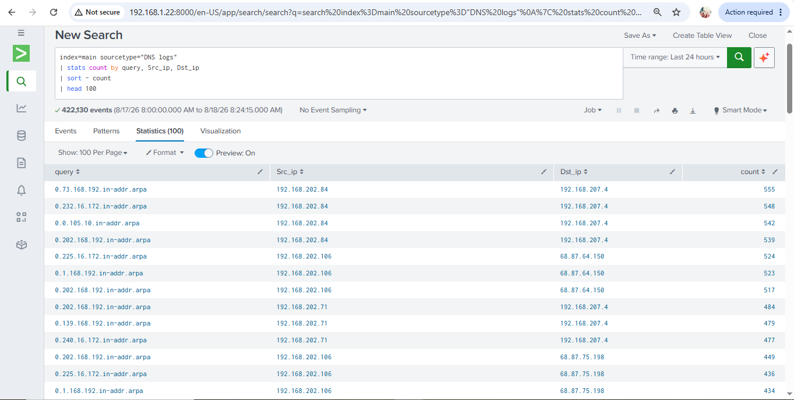

# 🌐 Project 01 – DNS Log Analysis & Monitoring using Splunk

## 📌 Project Overview

This project focuses on analyzing DNS logs using Splunk Enterprise to gain visibility into DNS activity and develop practical SOC monitoring skills.

The dataset was imported into Splunk and analyzed using SPL. The analysis focused on DNS queries, source IP addresses, destination IP addresses, and query frequency.

A Splunk dashboard was then created to visualize the analyzed DNS activity.

---

## 🎯 Objectives

- Analyze DNS logs using Splunk Enterprise
- Identify frequently occurring DNS queries
- Analyze source IP addresses
- Analyze destination IP addresses
- Correlate DNS queries with source and destination IPs
- Create a security monitoring dashboard
- Practice SPL-based log analysis

---

## 🛠️ Tools & Technologies

- Splunk Enterprise
- SPL (Search Processing Language)
- DNS Logs
- SIEM
- Network Security
- Log Analysis
- SOC Monitoring

---

## 🔍 Analysis Performed

### DNS Query Analysis

Analyzed DNS queries to identify frequently occurring requests and understand DNS activity within the dataset.

### Source IP Analysis

Analyzed source IP addresses to identify hosts generating DNS requests.

### Destination IP Analysis

Analyzed destination IP addresses to identify the endpoints receiving DNS traffic.

### Query Correlation

Created a table containing:

- DNS Query
- Source IP
- Destination IP
- Event Count

---

## 📊 Splunk Dashboard

The project includes a Splunk dashboard for visualizing DNS activity.

---

## 📋 DNS Query Analysis

---

## 🌐 Source & Destination IP Analysis

---

## 🔎 SPL Queries

The SPL queries used during the investigation are available in:

[SPL Queries](SPL/queries.spl)

---

## 📚 Documentation

Detailed technical documentation:

[DNS Log Analysis Documentation](Documentation/DNS-Log-Analysis.md)

---

## 🚨 Incident Report

Investigation report:

[DNS Investigation Report](Incident-Report.md)

---

## 🧠 Skills Demonstrated

- Splunk SIEM
- SPL
- DNS Log Analysis
- Network Security Monitoring
- Source/Destination IP Analysis
- Security Event Analysis
- Dashboard Creation
- SOC Investigation

---

## ⚠️ Security Note

This project was performed using a DNS log dataset for educational and cybersecurity training purposes.

The analysis demonstrates log visibility and investigation techniques and does not claim that the dataset contains confirmed malicious activity.

---

## 👨‍💻 Author

**Muhammad Tashfeen**

Cybersecurity Student | Aspiring SOC Analyst

**Focus:** SOC Operations | SIEM | Threat Detection | Log Analysis | Incident Response
